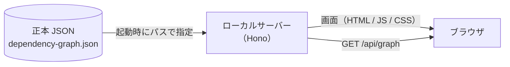

# depenomap

アプリケーションの依存関係を、ノードマップとして**閲覧する**ためのツール。

依存関係という事実をそのまま提示するところまでを担い、構成の良し悪しは判定しない。
綺麗な構成のときも、依存関係が壊れているときも、表示は変わらない。

表示の材料は、依存関係の抽出結果である**正本 JSON** 1 ファイルである。
正本 JSON はビルドに焼き込まず、**起動時にパスで指定して**読み込む。
同じ画面のまま、別のグラフ（別ブランチ・別コミットのスナップショット）を開ける。

---

## 全体像



サーバーが立つ理由は 2 つある。

1. ノードの配置を動的に扱うため（画面が静的ファイルの寄せ集めでは足りない）
2. 正本 JSON を**起動時のパス指定**で読み替えられるようにするため

---

## 前提

| 必要なもの | バージョン | 備考                               |
| ---------- | ---------- | ---------------------------------- |
| Node       | 24         | `flake.nix` の devShell が供給する |
| pnpm       | 10         | 同上                               |

Nix + direnv を使う場合は、リポジトリ直下で一度だけ許可する。

```console
$ direnv allow
$ pnpm install
```

---

## 起動

正本 JSON のパスは**必須**である。指定が無ければサーバーは起動しない。
「起動できた」ことが「どのグラフを見ているかが確定している」ことと同じ意味になるようにしてある。

### 開発（画面を書き換えながら見る）

```console
$ DEPENOMAP_GRAPH=test-data/dependency-graph.complex.json pnpm dev
```

→ http://localhost:5173

Vite の開発サーバーを主にして、そこに Hono を middleware として載せる。
プロセスは 1 つで、画面の HMR はそのまま効き、`/api/*` は画面と同一オリジンになる。

```
    ブラウザ
      │
      ├─ /              ──▶  Vite  ─────────▶  src/app/       （HMR つきで配信）
      │
      └─ /api/graph     ──▶  Hono  ─────────▶  正本 JSON      （要求のたびに読む）
                             ▲
                             └─ src/server/app.ts（本番と同じもの）
```

### 本番（ビルドしたものを配信する）

```console
$ pnpm build
$ pnpm start --graph test-data/dependency-graph.complex.json
```

→ http://localhost:5173

ビルドすると、画面とサーバーがそれぞれ `dist/` の下に出る。
起動後は Hono が両方を受け持つ。

```
    ブラウザ
      │
      ├─ /              ──▶  Hono  ─────────▶  dist/client/   （静的配信）
      │
      └─ /api/graph     ──▶  Hono  ─────────▶  正本 JSON      （要求のたびに読む）
                             ▲
                             └─ dist/server/main.js
```

> **Docker での起動は、まだ用意していない。**
> 解析対象リポジトリのマウントとホスト側パス解決（VSCode で開くために要る）と
> あわせて、後の段階で入れる。

---

## 起動パラメータ

| パラメータ        | 環境変数          | 既定値 | 説明                                                     |
| ----------------- | ----------------- | ------ | -------------------------------------------------------- |
| `--graph <path>`  | `DEPENOMAP_GRAPH` | なし   | 正本 JSON のパス。**必須**。相対指定は起動した場所が起点 |
| `--port <number>` | `DEPENOMAP_PORT`  | `5173` | 待ち受けポート                                           |

- 優先順位は **コマンドライン > 環境変数**
- 開発（`pnpm dev`）では、コマンドラインの引数が Vite のものになるため**環境変数で渡す**
- 知らないオプションを渡した場合は、無視せずエラーにして起動を止める

```console
$ pnpm start --graph ../todo-app/dependency-graph.json --port 8080
depenomap: http://localhost:8080
  正本 JSON: /Users/you/todo-app/dependency-graph.json
```

---

## グラフを差し替える

正本 JSON は**要求のたびに読み直す**。したがって差し替え方は 2 通りある。

```
    同じパスのファイルを書き換えた場合
      └─▶ ブラウザを再読み込みするだけでよい（サーバーの再起動は要らない）

    別のファイルを見たい場合
      └─▶ --graph / DEPENOMAP_GRAPH を変えて起動し直す
```

なお、動かしたノードの位置などの表示状態は引き継がない。
正本は JSON 側にあり、画面が持つ状態は揮発性である。

---

## グラフ取得の口

```
    GET /api/graph
```

**読み込みに失敗しても 200 を返す。** 読み込みの結果は、成功も失敗も同じ形で本文に載る。

読み込めた場合（警告があれば `warnings` に載る）:

```json
{
  "ok": true,
  "graph": { "schemaVersion": "1.0.0", "meta": {}, "nodes": [], "edges": [] },
  "warnings": [{ "type": "schema-version-differs", "expected": "1.0.0", "actual": "1.1.0" }]
}
```

読み込めなかった場合:

```json
{
  "ok": false,
  "errors": [{ "type": "read-failed", "path": "/srv/graph.json", "message": "ENOENT ..." }],
  "warnings": []
}
```

失敗を 4xx / 5xx に割り振らないのは、**失敗の理由が本文とステータスに二重化する**ためである。
「JSON が読めなかった」は HTTP としては正常に取得できた**結果**であり、
「サーバーに届かなかった」とは直す場所が違う。画面はこの 2 つを分けて扱う。

```
    サーバーに届かなかった   →  起動していない・ポートが違う   →  起動し直す
    正本 JSON が読めなかった →  パスが違う・JSON が壊れている  →  正本を直す
```

---

## 開発コマンド

| コマンド          | 内容                                                         |
| ----------------- | ------------------------------------------------------------ |
| `pnpm dev`        | 開発サーバー（Vite + Hono）を起動する                        |
| `pnpm build`      | 画面（`dist/client`）とサーバー（`dist/server`）をビルドする |
| `pnpm start`      | ビルド済みのサーバーを起動する                               |
| `pnpm test`       | テストを実行する（Vitest）                                   |
| `pnpm test:watch` | テストを監視実行する                                         |
| `pnpm type-check` | 型検査（画面 / サーバーの両方）                              |
| `pnpm lint`       | ESLint                                                       |
| `pnpm format`     | Prettier で整形する                                          |

コミット時は husky + lint-staged が、変更したファイルに ESLint と Prettier をかける。

---

## ディレクトリ

```
    src/
      core/                 サーバーと画面の両方から使う。ブラウザでも動く
        graph/              正本 JSON の型・スキーマ検査・読み込み口
        ir/                 表示用中間表現（被依存数・依存深度・検索キーなど）

      server/               ローカルサーバー
        app.ts              /api/graph。dev と本番で共通
        config.ts           起動パラメータの解釈
        main.ts             本番の起動口（静的配信 + 待ち受け）
        vite-plugin.ts      dev で Hono を Vite に載せるためのプラグイン

      app/                  画面（Vue 3）
        design/             デザイントークン

    test-data/              テスト用の正本 JSON
    dist/
      client/               ビルドした画面
      server/               ビルドしたサーバー
```

`src/core/` は `src/app/` と `src/server/` を参照しない。
Node 専用の API に依存するモジュールは `*.node.ts` という名前にし、画面側の型検査から外す。

---

## 現在の状態

画面はまだ**ノードマップを描かない**。
いま表示されるのは、指定した正本 JSON がサーバー経由で画面まで届いていることを
確認するための暫定表示（スナップショット名・ノード数・エッジ数、または読み込みの失敗理由）である。

```
    [済] 正本 JSON の読み込みと検査
    [済] 表示用中間表現の組み立て
    [済] 配信サーバーと、起動時のパス指定        ← いまここ
    [  ] デザイン基盤（トークン・テーマ）
    [  ] 画面の骨格と表示状態
    [  ] ノードマップの描画
```

設計上の判断（ADR）とユニット分割の計画は `plan/` に置いてある（Git 管理外）。
