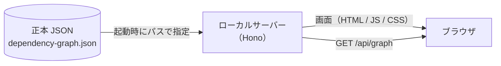

# depenomap

アプリケーションの依存関係を、ノードマップとして**閲覧する**ためのツール。

依存関係という事実をそのまま提示するところまでを担い、構成の良し悪しは判定しない。
綺麗な構成のときも、依存関係が壊れているときも、表示は変わらない。

表示の材料は、依存関係の抽出結果である**正本 JSON** 1 ファイルである。
正本 JSON はビルドに焼き込まず、**起動時にパスで指定して**読み込む。
同じ画面のまま、別のグラフ（別ブランチ・別コミットのスナップショット）を開ける。

---

## 全体像



サーバーが立つ理由は 2 つある。

1. ノードの配置を動的に扱うため（画面が静的ファイルの寄せ集めでは足りない）
2. 正本 JSON を**起動時のパス指定**で読み替えられるようにするため

---

## 前提

| 必要なもの | バージョン | 備考                               |
| ---------- | ---------- | ---------------------------------- |
| Node       | 24         | `flake.nix` の devShell が供給する |
| pnpm       | 10         | 同上                               |

Nix + direnv を使う場合は、リポジトリ直下で一度だけ許可する。

```console
$ direnv allow
$ pnpm install
```

---

## 起動

正本 JSON のパスは**必須**である。指定が無ければサーバーは起動しない。
「起動できた」ことが「どのグラフを見ているかが確定している」ことと同じ意味になるようにしてある。

### 開発（画面を書き換えながら見る）

```console
$ DEPENOMAP_GRAPH=test-data/dependency-graph.complex.json pnpm dev
```

→ http://localhost:5173

Vite の開発サーバーを主にして、そこに Hono を middleware として載せる。
プロセスは 1 つで、画面の HMR はそのまま効き、`/api/*` は画面と同一オリジンになる。

```
    ブラウザ
      │
      ├─ /              ──▶  Vite  ─────────▶  src/app/       （HMR つきで配信）
      │
      └─ /api/graph     ──▶  Hono  ─────────▶  正本 JSON      （要求のたびに読む）
                             ▲
                             └─ src/server/app.ts（本番と同じもの）
```

### 本番（ビルドしたものを配信する）

```console
$ pnpm build
$ pnpm start --graph test-data/dependency-graph.complex.json
```

→ http://localhost:5173

ビルドすると、画面とサーバーがそれぞれ `dist/` の下に出る。
起動後は Hono が両方を受け持つ。

```
    ブラウザ
      │
      ├─ /              ──▶  Hono  ─────────▶  dist/client/   （静的配信）
      │
      └─ /api/graph     ──▶  Hono  ─────────▶  正本 JSON      （要求のたびに読む）
                             ▲
                             └─ dist/server/main.js
```

### Docker（配布された形で動かす）

Node も pnpm も要らない。Docker だけあればよい。

```console
$ docker build -t depenomap .
$ docker run --rm -p 127.0.0.1:5173:5173 \
    -v /Users/you/todo-app:/repo:ro \
    -v /Users/you/todo-app/dependency-graph.json:/graph.json:ro \
    depenomap --graph /graph.json --repo /Users/you/todo-app=/repo
```

→ http://localhost:5173

**コンテナの中には解析対象が無い。** 正本 JSON も、解析対象のリポジトリも、
ホスト側にしかない。だからマウントして、コンテナの中から見える位置を渡す。

```
    ホスト                          コンテナ
      /Users/you/todo-app        ──▶  /repo          （-v でマウント）
      .../dependency-graph.json  ──▶  /graph.json     （-v でマウント）
                                      ▲
                                      └─ --graph /graph.json
```

`--repo` に `<ホスト側>=<マウント先>` の形で渡すのは、**同じ場所を 2 つの名前で
指している**ためである。存在を確かめるのはコンテナから見える側（`/repo`）、
エディタへ渡すのはホストから見える側（`/Users/you/todo-app`）になる。
コンテナの中の位置をエディタに渡しても、そのパスはホストには無い。

ホスト側に渡すのは、**正本 JSON の `meta.rootDir` に対応する位置**である。ノードの
`path` はそこからの相対であり、別の位置（モノレポのルートなど）を渡すと、そこを起点と
した別のファイルを指す。`rootDir` は解析したマシンの絶対パスで、いま動かしているマシンの
位置と一致するとは限らないため、ここは推測せずに明示で受け取る。

図を読むだけなら `--repo` は要らない。VSCode で開くときにだけ使う。

コンテナは root ではなく `node`（UID 1000）で走る。マウントしたものは**そのユーザーから
読める必要がある**。読めないと、正本 JSON は読み込み失敗として画面に伝わり、リポジトリ側は
`exists: false`（実体が無い）と区別が付かない形になる。自分の権限で走らせるなら
`--user "$(id -u):$(id -g)"` を足す。

コンテナの中では全インターフェースで待ち受ける（`Dockerfile` の
`DEPENOMAP_HOST=0.0.0.0`）。コンテナの中のループバックは外から届かないためである。
**ホスト側のどこに見せるかは `-p` が決める**ので、ここを `127.0.0.1:5173:5173` と
書いて、このマシンからだけ開ける形にしている。

`-p 5173:5173` と書くと同じネットワークの誰からでも開ける。この口には認証が無く、
`/api/graph` は解析対象の構成を、`/api/locate` はマウントしたリポジトリのファイルの
有無をそのまま返す。他のマシンから見せる必要があるときだけ、そう書く。

---

## 起動パラメータ

| パラメータ        | 環境変数          | 既定値      | 説明                                                     |
| ----------------- | ----------------- | ----------- | -------------------------------------------------------- |
| `--graph <path>`  | `DEPENOMAP_GRAPH` | なし        | 正本 JSON のパス。**必須**。相対指定は起動した場所が起点 |
| `--port <number>` | `DEPENOMAP_PORT`  | `5173`      | 待ち受けポート                                           |
| `--repo <path>`   | `DEPENOMAP_REPO`  | なし        | 解析対象リポジトリ `<ホスト側>[=<マウント先>]`。絶対パス |
| `--host <addr>`   | `DEPENOMAP_HOST`  | `127.0.0.1` | 待ち受ける宛先                                           |

- 優先順位は **コマンドライン > 環境変数**
- 開発（`pnpm dev`）では、コマンドラインの引数が Vite のものになるため**環境変数で渡す**
- 知らないオプションを渡した場合は、無視せずエラーにして起動を止める
- `--repo` のホスト側には、正本 JSON の `meta.rootDir` に対応する位置を渡す
- `--repo` の `=<マウント先>` を省くと、ホスト側と同じパスで見えるものとして扱う
  （Docker を経由せずに動かすとき）
- `--host` の既定はループバックだけである。この口には認証が無く、`/api/graph` は
  解析対象の構成をそのまま返すため、既定では同じネットワークの他人に見せない

```console
$ pnpm start --graph ../todo-app/dependency-graph.json --port 8080
depenomap: http://localhost:8080
  正本 JSON: /Users/you/todo-app/dependency-graph.json
```

---

## グラフを差し替える

正本 JSON は**要求のたびに読み直す**。したがって差し替え方は 2 通りある。

```
    同じパスのファイルを書き換えた場合
      └─▶ ブラウザを再読み込みするだけでよい（サーバーの再起動は要らない）

    別のファイルを見たい場合
      └─▶ --graph / DEPENOMAP_GRAPH を変えて起動し直す
```

なお、動かしたノードの位置などの表示状態は引き継がない。
正本は JSON 側にあり、画面が持つ状態は揮発性である。

---

## グラフ取得の口

```
    GET /api/graph
```

**読み込みに失敗しても 200 を返す。** 読み込みの結果は、成功も失敗も同じ形で本文に載る。

読み込めた場合（警告があれば `warnings` に載る）:

```json
{
  "ok": true,
  "graph": { "schemaVersion": "1.0.0", "meta": {}, "nodes": [], "edges": [] },
  "warnings": [{ "type": "schema-version-differs", "expected": "1.0.0", "actual": "1.1.0" }]
}
```

読み込めなかった場合:

```json
{
  "ok": false,
  "errors": [{ "type": "read-failed", "path": "/srv/graph.json", "message": "ENOENT ..." }],
  "warnings": []
}
```

失敗を 4xx / 5xx に割り振らないのは、**失敗の理由が本文とステータスに二重化する**ためである。
「JSON が読めなかった」は HTTP としては正常に取得できた**結果**であり、
「サーバーに届かなかった」とは直す場所が違う。画面はこの 2 つを分けて扱う。

```
    サーバーに届かなかった   →  起動していない・ポートが違う   →  起動し直す
    正本 JSON が読めなかった →  パスが違う・JSON が壊れている  →  正本を直す
```

---

## ホスト側の位置を求める口

```
    GET /api/locate?path=<ノードの相対パス>
```

相対パスは `encodeURIComponent` を通して渡す。クエリの `+` は復号すると空白になり、
`a+b.ts` のような名前がそのままだと別のファイルを指してしまう。

ノードが持つ `path` は `meta.rootDir` からの相対である。**画面が動く場所と実ファイルが
在る場所は違う**（Docker なら特にそうなる）ので、その突き合わせをサーバーが引き受ける。
ノードから VSCode で開くときに使う。

`--repo` を渡して起動し、そこに実体があった場合:

```json
{ "resolved": true, "hostPath": "/Users/you/todo-app/src/app.ts", "exists": true }
```

`hostPath` は**ホストから見た**絶対パスである。`exists` はコンテナから見える側
（マウント先）で確かめた結果で、`false` でも `hostPath` は返す。
**実体が無いことを欠陥として扱わない。** 正本 JSON を取ってからファイルが移動した、
という状況はふつうに起こる。

解決できなかった場合は、その理由を返す。

```json
{ "resolved": false, "reason": "no-repo" }
```

| `reason`   | 意味                                                                 |
| ---------- | -------------------------------------------------------------------- |
| `no-repo`  | `--repo` が渡されていない（図を読むだけなら、これでよい）            |
| `bad-path` | 相対パスとして受け取れない形（絶対パス・リポジトリの外を指す、など） |

---

## 開発コマンド

| コマンド          | 内容                                                         |
| ----------------- | ------------------------------------------------------------ |
| `pnpm dev`        | 開発サーバー（Vite + Hono）を起動する                        |
| `pnpm build`      | 画面（`dist/client`）とサーバー（`dist/server`）をビルドする |
| `pnpm start`      | ビルド済みのサーバーを起動する                               |
| `pnpm test`       | テストを実行する（Vitest）                                   |
| `pnpm test:watch` | テストを監視実行する                                         |
| `pnpm type-check` | 型検査（画面 / サーバーの両方）                              |
| `pnpm lint`       | ESLint                                                       |
| `pnpm format`     | Prettier で整形する                                          |

コミット時は husky + lint-staged が、変更したファイルに ESLint と Prettier をかける。

---

## ディレクトリ

```
    src/
      core/                 サーバーと画面の両方から使う。ブラウザでも動く
        graph/              正本 JSON の型・スキーマ検査・読み込み口
        ir/                 表示用中間表現（被依存数・依存深度・検索キーなど）

      server/               ローカルサーバー
        app.ts              /api/graph と /api/locate。dev と本番で共通
        locate.ts           相対パス → ホスト側で開ける位置
        config.ts           起動パラメータの解釈
        main.ts             本番の起動口（静的配信 + 待ち受け）
        vite-plugin.ts      dev で Hono を Vite に載せるためのプラグイン

      app/                  画面（Vue 3）
        design/             デザイントークン・テーマ切り替え
        shell/              画面の骨格と、表示状態の器（Pinia）
        editor/             ノードから VSCode で開く（右クリックメニュー）
        legend/             図の読み方（凡例・描き方の断り）

    test-data/              テスト用の正本 JSON
    dist/
      client/               ビルドした画面
      server/               ビルドしたサーバー
```

`src/core/` は `src/app/` と `src/server/` を参照しない。
Node 専用の API に依存するモジュールは `*.node.ts` という名前にし、画面側の型検査から外す。

---

## 現在の状態

**ファイル単位とメソッド単位のノードマップが出る。** ノードを列に分けて置き、依存を
「使う側 → 使われる側」の矢印で描く。ノードをクリックすると選択され、背景を
クリックすると解除される。

ツールバーの切り替えで粒度が変わる。メソッド粒度では、ノードに所属ファイルの
パスが出て、クラスとインターフェースの対応は破線、インターフェース経由の呼び出しは
色の違う線と中点の印で示す。切り詰めた識別子の全文は、ノードに重なる説明で読める。

並べ方は層と依存深度で切り替えられる。深度の起点は、未選択なら他から使われて
いないノード群、選択中ならそのノード。起点からたどり着けないノードは、最後尾の
列にまとまる（隠さない）。

サイドバーにはファイルの一覧が出る。ファイルを開くとその中のメソッドが並び、
初期表示はすべて閉じている。並べ替えはパス順と被依存数の降順。行を押すとその
ノードが選ばれ、キャンバスで選んだメソッドの所属ファイルは自動で開く。一覧は
畳めて、畳んだぶんキャンバスが広がる。

検索欄に名前を入れると一覧が絞られる。対象はファイル名・メソッド名・パスで、
部分一致・大文字小文字を区別しない。`src/domain/` のようなディレクトリ名でも
同じ欄で絞れる。当たったメソッドを持つファイルは開いた状態で出る。図のほうは
絞らない。

ノードを押すと、そのノードと直接の依存先・依存元だけが残る。使っている側と
使われている側の両方が同時に残るので、影響範囲も到達範囲も同じ操作で追える。
絞り込み中は左上にその旨が出て、そこの ✕・Esc・同じノードをもう一度押す、の
いずれでも解ける。もう一度押すと選択も外れる。一覧や検索の行から選んでも同じ
経路を通る。

ツールバーの `‹` `›` で、たどってきた経路を行き来できる。戻った先では、その
ノードを見ていたときの見え方（粒度と、周辺だけに絞っていたか）まで帰る。経路の
一覧は出さない。

絞り込み中は、依存先が呼び出し順に並ぶ。並びの根拠はソース上の出現順だけで、
実行の順序ではない（条件分岐やループがあれば一致しない）。そのことは絞り込みの
印に書いてある。順序を持つのは呼び出しと生成だけなので、`import` のように順序の
無い依存しかないときは並べ替えず、断りも出さない。

循環している依存は、図でもサイドバーでも印が付く。ノードは破線の枠と「循環」の
札、循環に含まれる線は同じ色の破線になる。型としてのみの循環（実行時に値の
やり取りが起きないもの）は、図の札が「循環（型のみ）」と出す。循環は正本 JSON が
持っている事実をそのまま出すだけで、**検出も、良し悪しの判定もしない**。

左端のレールから概要を開ける。規模（ファイル数・メソッド数・依存の本数・層の数）、
層ごとの構成比、層をまたぐ依存の流れ（行が呼ぶ側、列が呼ばれる側のマトリクス）、
被依存数の多いファイル上位 8 件（どの層から使われているかの内訳つき）、そして
このグラフの素性（スナップショット・ブランチ・コミット・生成日時・tsconfig・
rootDir）が出る。**出るのは事実の集計だけ**で、違反件数も指摘も深刻度も含まない。
層をまたぐ依存も流れを示すだけで、向きの正誤は判定しない。書き出す口は持たない。
上位のファイルからは図へ移れる。

キャンバスはトラックパッドで動かせる。2 本指スクロールで縦横に移動し、Shift を
押すと横だけに動く。ピンチ（⌘・Ctrl + ホイールも同じ）で拡大縮小し、ポインタの
下にあるものが動かない。倍率はツールバーに出て、上下限（20%〜250%）に当たれば
そこで止まる。手で動かしたあとは、同じツールバーの全体表示で図全体に戻せる。

ノードは掴んで動かせる。離した位置に留まり、粒度や並べ方を切り替えても、絞り込みで
一度消えても、その位置のまま戻ってくる。**動かした位置は表示上のもので、読み込んだ
JSON は書き換えない**。保存もしない。動かすと図の左上に件数が出て、そこに触れると
どれを動かしたのかが名前で分かる。ツールバーの「配置を戻す」で既定の並びへ戻る。
動かしていないときは押せないので、押せるかどうかがそのまま状態を表す。

静的解析で追えなかった依存も、レールから開く一覧で確認できる。呼び出し元・式・
理由（DI コンテナの文字列トークン、動的 import など）が出て、推測できた行き先が
あれば「推測した行き先」として分けて示す。**確定した依存と推測を図の上で混ぜない** —
推測は矢印にせず、呼び出し元のノードに「未追跡」の印を出すだけにしてある。候補から
図へ移ることはでき、その場合は「推測の候補へ移動しました」と式が出る。追えなかった
ことを欠陥として扱わず、是正の示唆も警告も出さない。

メソッド粒度では、**インターフェース経由の呼び出しをどちらの行き先で読むか**を
選べる。既定は型検査器が返した答え（インターフェース宛）で、実装宛に切り替えると、
呼び出しの線が実装へ向かう。実装が複数あれば、その数だけ線が分かれる。DI を使う
構成では、これが無いと「実際にどの層のどのクラスを使っているか」が図から読めない。

**読み替えても正本 JSON が持つ事実は消えない** — 戻せば型検査器の答えが見える。
読み替えているあいだ、被依存数・依存数・列（深度）・概要は**インターフェース宛の
まま**で、そのことを左上に断りとして出す。

図の左下から**凡例**を開ける。層の色、線の 4 種（確定した依存・implements・
インターフェース経由・循環）、ノードの印（循環・未追跡）、ノード右下の
`↙ 被依存数 ↗ 依存数` とその数え方が読める。**既定は畳んである。**

左上には描き方の断りが出る。インターフェース経由の呼び出しを**インターフェース宛**に
描いていること（メソッド粒度では本数も）と、図に出せるノードが無いこと。
後者は**理由まで出す** — 正本 JSON がそもそも空なのか、その粒度に無いだけ
なのかで、次にやることが違う。

ノードを右クリックすると、VSCode で開ける。ファイルノードはそのファイルを、メソッド
ノードは所属ファイルの該当行を開く。開くのはブラウザ経由で、**ホスト側のパスへ
解決してから**渡す（起動時の `--repo` が要る）。渡されていないとき、パスから位置を
決められないとき、ホスト側に実体が無いときは、**押す前にその理由がメニューに出る**。
開けないことは欠陥として扱わない。

デザイントークンの一覧と、拡張するときのルールは
[`src/app/design/README.md`](src/app/design/README.md) にある。

```
    [済] 正本 JSON の読み込みと検査
    [済] 表示用中間表現の組み立て
    [済] 配信サーバーと、起動時のパス指定
    [済] デザイン基盤（トークン・テーマ）
    [済] 画面の骨格と表示状態
    [済] ノードマップの描画（ファイル粒度）
    [済] メソッド粒度と粒度の切り替え
    [済] 列の並べ方（層 / 依存深度）
    [済] サイドバーの一覧と並べ替え
    [済] 名前での検索
    [済] 選択と絞り込み・依存のたどり
    [済] 戻る・進む（移動履歴）
    [済] 依存先の並び（呼び出し順）
    [済] 循環の事実表示
    [済] 概要パネル
    [済] キャンバス操作（トラックパッド）
    [済] ノード配置の手動変更とリセット
    [済] 未解決依存の提示
    [済] ローカル起点の解決（Docker・マウント・パス解決）
    [済] ノードから VSCode で開く
    [済] 凡例と、描き方についての断り
    [済] 経由の呼び出しの読み方（interface / 実装）  ← いまここ
```

設計上の判断（ADR）とユニット分割の計画は `plan/` に置いてある（Git 管理外）。
